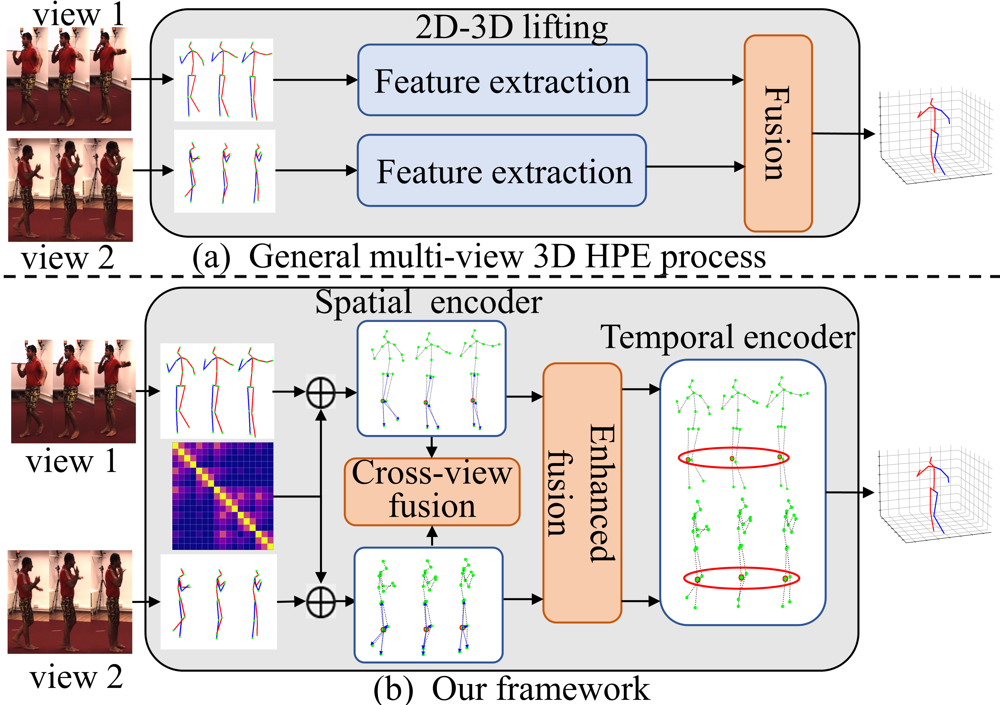

# Efficient Hierarchical Multi-view Fusion Transformer for 3D Human Pose Estimation [ACMMM 2023]

<p align="center"></p>

> [**Efficient Hierarchical Multi-view Fusion Transformer for 3D Human Pose Estimation**](https://dl.acm.org/doi/pdf/10.1145/3581783.3612098),
> Kangkang Zhou, Lijun Zhang, Feng Lu, Xiang-Dong Zhou, Yu Shi,
> *MM '23: Proceedings of the 31st ACM International Conference on Multimedia*

## Installation

- Create a conda environment: ```conda create -n hmvformer python=3.7```
- Download cudatoolkit=11.0 from [here](https://developer.nvidia.com/cuda-11.0-download-archive) and install 
- ```pip3 install torch==1.7.1+cu110 torchvision==0.8.2+cu110 -f https://download.pytorch.org/whl/torch_stable.html```
- ```pip3 install -r requirements.txt```

## Dataset Setup

Please download the dataset from [Human3.6M](http://vision.imar.ro/human3.6m/) website and refer to [VideoPose3D](https://github.com/facebookresearch/VideoPose3D) to set up the Human3.6M dataset ('./dataset' directory). 
Or you can download the processed data from [here](https://drive.google.com/drive/folders/1F_qbuZTwLJGUSib1oBUTYfOrLB6-MKrM?usp=sharing). 

```bash
${POSE_ROOT}/
|-- dataset
|   |-- data_3d_h36m.npz
|   |-- data_2d_h36m_gt.npz
|   |-- data_2d_h36m_cpn_ft_h36m_dbb.npz
```

## Download Pretrained Model

The pretrained model can be found in the './checkpoint/pretrained' directory. 

## Test the Model

To test on a pretrained model on Human3.6M:

```bash
python main.py --test --previous_dir './checkpoint/pretrained/pretrained.pth'
```

## Train the Model
To train a model on Human3.6M:

```bash
python main.py --frames 27 --batch_size 1024 --nepoch 50 --lr 0.0002 
```

## Acknowledgement

Our code is extended from the following repositories. We thank the authors for releasing the codes. 

- [PoseFormer](https://github.com/zczcwh/PoseFormer)
- [VideoPose3D](https://github.com/facebookresearch/VideoPose3D)
